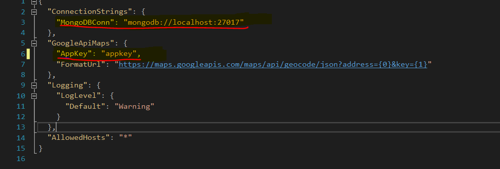
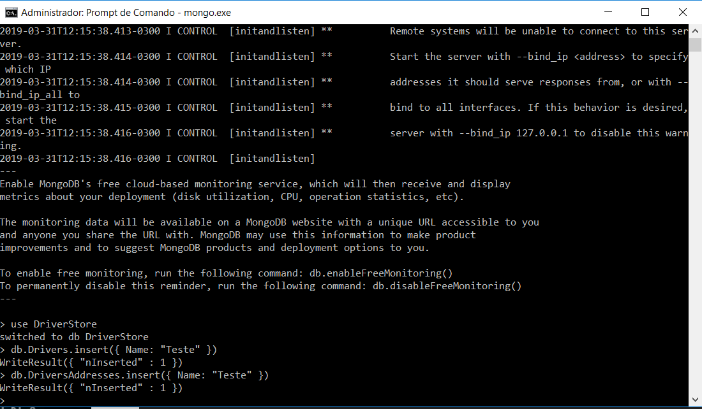

# challenge-dev - Desafio para backend Software Engineer

## Objetivo e avaliação

Objetivo deste teste é avaliar como você irá considerar questões como **arquitetura e design de software, modelagem e aplicação de técnicas e conceitos de programação** e não simplesmente resolver o problema proposto, visto que o mesmo não oferece dificuldades reais para implementação.  

## Entrega do projeto

Faça um fork deste projeto e ao concluir envie um pull request (PR) com sua implementação. Ao enviar o PR nos informe:

 - Explicação sobre a solução desenvolvida (Markdown/Plain Text);
 - Quanto tempo você levou para desenvolver a solução.

## Escopo

Precisamos de uma biblioteca para gerenciar o cadastro de motoristas.

**Front-end não é necessário e não será avaliado**, porém precisamos de uma API que permita:

 - criar, editar e excluir um motorista.

Um cadastro de motorista possui os campos:

 - Nome (primeiro e último);
 - Carro (marca, modelo e placa);
 - Endereço completo.

Adicionamente, ao cadastrar um endereço deve ser **buscada as coordenadas** utilizando a [API do Google Maps](https://developers.google.com/maps/documentation/geocoding) e elas devem ser armazenadas junto com o cadastro.

Além do cadastro também será necessário disponibilizar uma **listagem dos cadastros em ordem alfabética** por nome **ou** sobrenome.

### Obrigatório
 - .NET Core - C#
 - WebAPI
 - IoC
 - Código limpo

### Desejável
 - Documentação da API
 - Testes
 - Nos informe também o nível de dificuldade e um feedback sobre o desafio proposto [nesta pesquisa](https://goo.gl/forms/qui1n636NKY2w96V2)
 
 
 
 ### Teste _ Marcio Guilherme
 
 Para executar é necessário 
1) Configurar a AppKey da API do Google 
2) Configurar a string de conexão para um MongoDB

3) Acessar o mongo criar o banco e as coleções 

use DriverStore
db.Drivers.insert({ Name: "Teste" })
db.DriversAddresses.insert({ Name: "Teste" })
